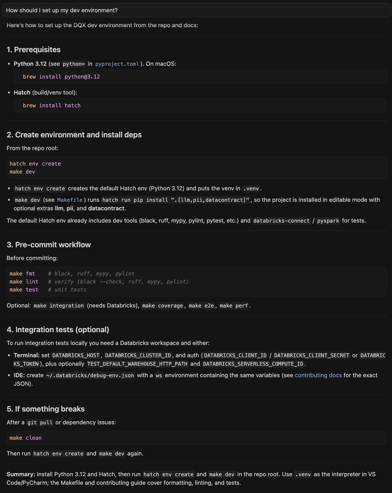

# CUJ

## I need to set up my dev environment

Am I supposed to use a Makefile? Create a virtual environment first? Is it done for me? Which Python package manager is the team using? Ask Cursor!

Example with [dqx](https://github.com/databrickslabs/dqx):

And you learn useful information along the way.

## I need to understand how to use a framework/codebase

Ask Cursor to explain it to you.
TODO: add specific question and example (one of our PS projects?)

## I need to modify a codebase I’ve never worked on before

Ask Cursor:
- What the codebase does at a high level
- How the code is structured
- How to test modifications: unit tests and manual tests

TODO: pick one PS project?

# I need to create a new feature

- Use the Plan mode and describe clearly and succinctly (TODO: be more precise here, give example)
- Review the plan created by Cursor
- Make adjustments to the plan if needed (TODO: give example)
- When okay with the plan, click on Build

TODO: example
